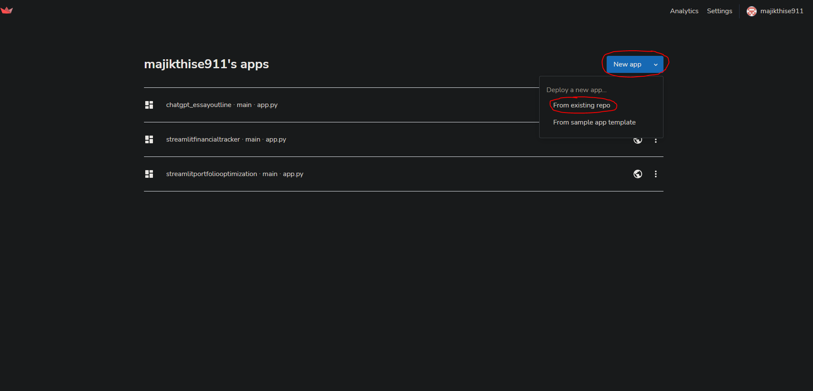
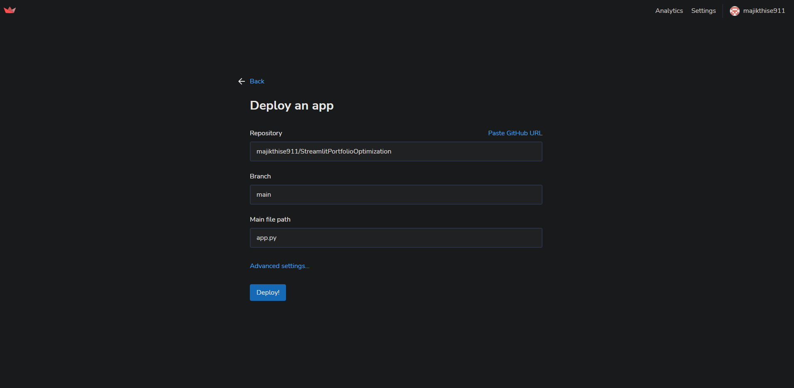
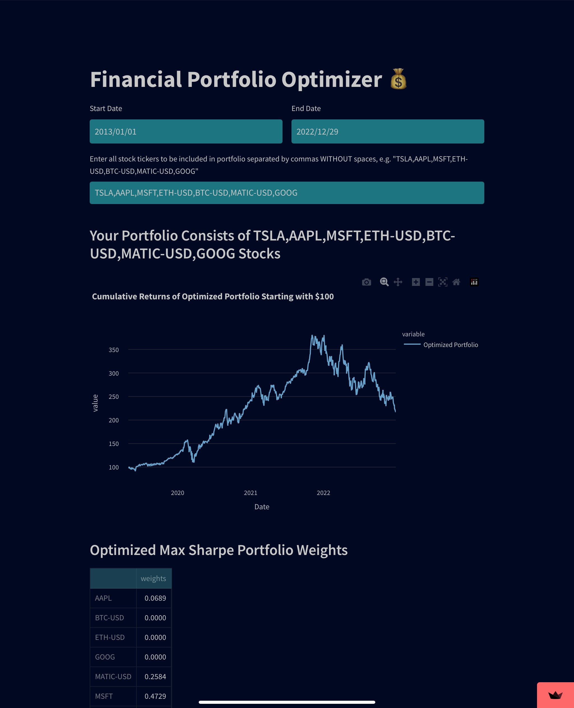
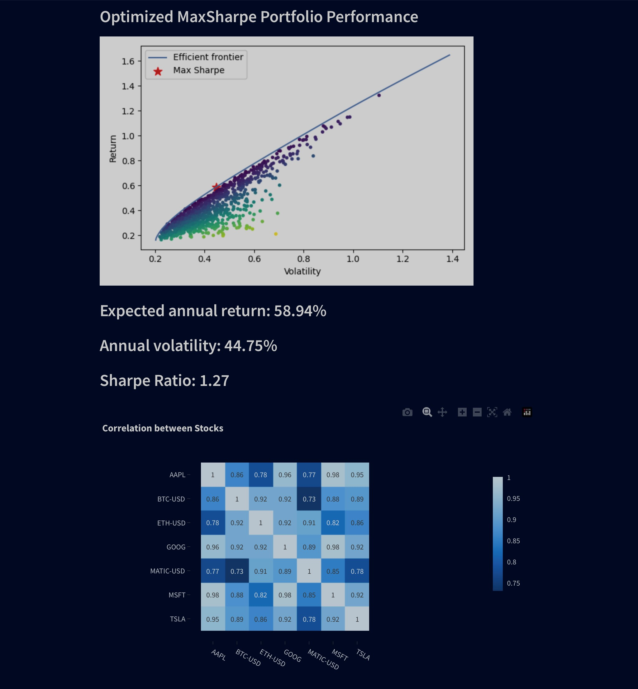
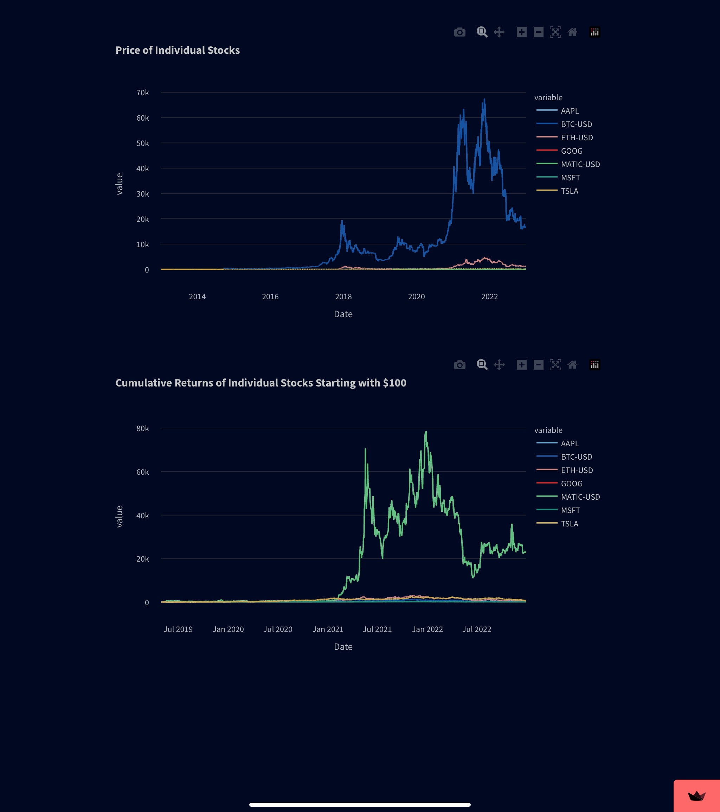

# StreamlitPortfolioOptimization

This repository contains a streamlit app that allows users to optimize their investment portfolios using modern portfolio theory (MPT).

## Running on Localhost 

### Getting Started

To get started, clone the repository and install the required dependencies:

git clone https://github.com/majikthise911/StreamlitPortfolioOptimization.git
pip install -r requirements.txt


```
git clone https://github.com/majikthise911/StreamlitPortfolioOptimization.git
pip install -r requirements.txt
```
Then, run the app using the following command:

```
Then, run the app using the following command:
```
The app will be served locally at http://localhost:8501.
## Running on Streamlit Cloud
This app can also be ran from [Streamlit Cloud](https://streamlit.io/cloud), which enables anyone with the URL to be able to interact with the application.

Steps 
1. Create [GitHub](https://github.com/) repo and upload this cloned repo to the repo.
2. Create or login to [Streamlit Cloud](https://streamlit.io/cloud) account 
3. Click "New app" then select "From existing repo" and select the repo that this code was uploaded to in the dropdown provided. 



### Features

- Input stock ticker symbols to include in the portfolio
- Set custom weights for each stock or use the app's recommended weights based on MPT
- View a graph of the efficient frontier, which shows the trade-off between risk and return for the optimized portfolio
    - In modern portfolio theory (MPT), the efficient frontier is a graphical representation of the set of portfolios that offer the highest expected return for a given level of risk. It is constructed by plotting the returns and standard deviations of different portfolios, with the most efficient portfolios being located on the curve closest to the upper left corner of the graph (representing the highest expected return for a given level of risk). The efficient frontier helps investors select portfolios that offer the highest expected return for a given level of risk, or alternatively, the lowest level of risk for a given level of expected return. It can be used to construct portfolios that are well-diversified and have the potential to maximize return while minimizing risk. 
- View summary statistics for the optimized portfolio, including expected return, standard deviation, and Sharpe ratio






### Dependencies
- Python 3.6 or higher
- Streamlit
- Pandas
- Numpy
- Scikit-learn
- Matplotlib
- Yahoo Finance API

## Credits
- [Modern Portfolio Theory (MPT)](https://en.wikipedia.org/wiki/Modern_portfolio_theory)
- [Efficient Frontier](https://en.wikipedia.org/wiki/Efficient_frontier)
- [Sharpe Ratio](https://en.wikipedia.org/wiki/Sharpe_ratio)